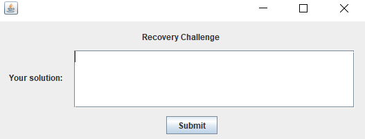

# Recovery
Could you help me recovery my number?
File: [recovery.jar](recovery.jar)
Note: The flag is not in flag format, please wrap it in format when you submit. ISITDTU{x, y, z, ...}
Update: "Pre-order"


### Initial Analysis
For this challenge, we were given a jar file, [recovery.jar](recovery.jar). This is what we see when we run it:


Let's try entering in some numbers:


So our goal for this challenge is to enter the correct sequence of numbers, and that will be our flag!


### Tools
I used [JD-GUI](https://github.com/java-decompiler/jd-gui), a java decompiler, to look at the code behind this program. 


### Decompiling
The main function:


Taking a look at the FrmProblem class, we can see what happens when we click the submit button:


It looks like our input is being checked somehow against the arrays *s* and *l*, and if the function returns true, we have out flag.
Let's see what *check()* is doing:


It's just returning true is the two arrays given are equal. Okay, now let's look at the *getResultA()* and *getResultB()* functions:


These functions are being run on our input. It looks like both functions insert our input into a binary tree. The *getResultA()* function returns the in-order traversal of the tree, and *getResultB()* returns the post-order traversal of the tree.

It's clear what we need to do now. We need to give the program a list of numbers to be inserted into a binary tree such that the in-order traversal is equal to the array *s* and the post-order traversal is equal to the array *l*.


### Computing the Answer
I believe that there are actually a few different inputs you can give the program that will give you the correct answer. For example, submitting the reverse of post-order array, *l*, will give you a successful response, however it is not the correct flag.

An update to the challenge was posted, and it read "Pre-order". This hints that they're looking specifcally for the pre-order traversal of the tree. After some searching, I stumbled upon an [algorithm](https://www.geeksforgeeks.org/construct-a-binary-tree-from-postorder-and-inorder/) to do exacly this. I [modified it](script.py) to run on the arrays, *s* (in-order) and *l* (post-order), we were given.


After formatting it the correct way and submitting it to the java progam:


Woo, we did it!

### The Flag
Now, we just have to wrap it in the flag format:
```
ISITDTU{509, 278, 9, 201, 101, 61, 11, 48, 38, 33, 35, 40, 44, 89, 85, 106, 180, 135, 110, 159, 150, 200, 188, 241, 214, 253, 269, 268, 275, 358, 356, 327, 285, 301, 301, 381, 363, 476, 471, 428, 399, 396, 413, 449, 434, 445, 462, 497, 496, 492, 481, 634, 628, 540, 520, 526, 534, 589, 621, 599, 613, 621, 623, 965, 658, 652, 650, 653, 946, 877, 708, 679, 665, 691, 836, 764, 716, 711, 722, 752, 756, 827, 808, 771, 773, 786, 807, 826, 842, 867, 856, 875, 922, 889, 879, 892, 951, 993, 980, 996}
```

